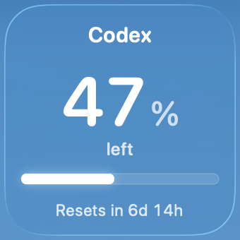
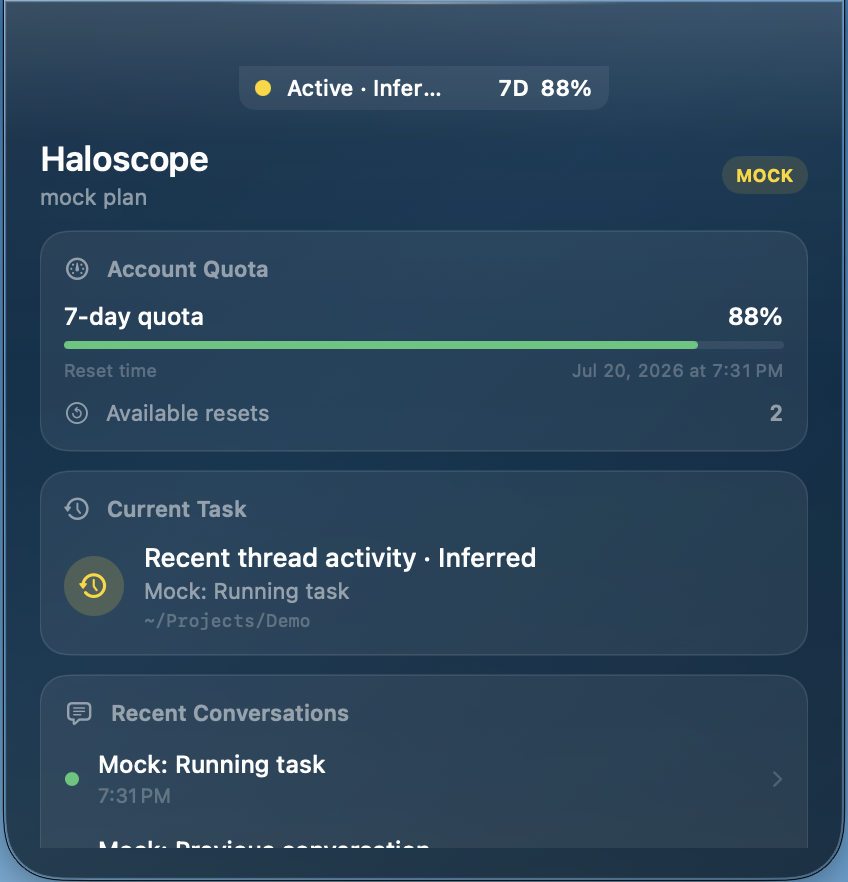

# Haloscope

English | [简体中文](README.zh-CN.md)

[](https://github.com/HaochengLuo/Haloscope/actions/workflows/ci.yml)

Haloscope is a native macOS Codex status monitor built with SwiftUI and an AppKit `NSPanel`. It combines a notch-attached status panel with a desktop widget and supports macOS 14 or later. All data comes from a separate `codex app-server --stdio` process: Haloscope does not read Codex Desktop's private database, scrape its UI, or estimate token counts.

> Haloscope is an unofficial open-source project and is not affiliated with or endorsed by OpenAI. Codex and related trademarks belong to their respective owners.

## Preview

<p align="center">
  
</p>

<p align="center"><em>Liquid Glass desktop widget</em></p>

<p align="center">
  
</p>

<p align="center"><em>Compact notch status</em></p>

<table>
  <tr>
    <td width="50%" valign="top"></td>
    <td width="50%" valign="top"></td>
  </tr>
  <tr>
    <td align="center"><em>Account and task overview</em></td>
    <td align="center"><em>Conversation and token activity</em></td>
  </tr>
</table>

## Current status

The interface can follow the system language or switch between English and Simplified Chinese at runtime. The desktop widget shows the remaining 7-day allowance, reset countdown, and available reset credits. Both the widget and notch panel use a Liquid Glass design, with the native glass effect on macOS 26 and a material fallback on earlier supported versions.

## Build and run

Requirements:

- macOS 14 or later
- Xcode 26 or later for building the current Liquid Glass source
- A working, authenticated Codex CLI installation

1. Open `Haloscope.xcodeproj` in Xcode.
2. Select the same development Team for the Haloscope and HaloscopeWidget targets. Replace the Bundle IDs, App Group, and Keychain Group with unique identifiers owned by that Team.
3. Run the Haloscope scheme.
4. Right-click the desktop, choose **Edit Widgets**, search for **Haloscope**, and add the small widget.

Haloscope looks for `codex` in this order: the custom path selected in Settings, `~/.local/bin`, Homebrew, system paths, and the login shell.

Run the test suite from the command line:

```bash
swift test --disable-sandbox
```

To verify the complete app and widget-extension packaging without a signing identity:

```bash
UNSIGNED=1 scripts/build_app.sh
```

An unsigned widget cannot register with macOS. For a signed local build, provide the Team through an environment variable so personal signing information is not stored in the repository:

```bash
HALOSCOPE_DEVELOPMENT_TEAM=YOUR_TEAM_ID scripts/build_app.sh
```

When using your own App Group, also provide `HALOSCOPE_APP_GROUP_IDENTIFIER` and `HALOSCOPE_KEYCHAIN_GROUP_SUFFIX`. The build output is written to `dist/Haloscope.zip`.

Generated protocol schemas are intentionally excluded from Git history. Run `scripts/generate_protocol_schemas.sh` to recreate them locally when investigating protocol changes.

## Permissions and privacy

The current distribution design uses a non-sandboxed Developer ID app because Haloscope must launch the user-selected Codex CLI and let it access its normal state directory. Haloscope does not require Accessibility, screen recording, browser cookies, or ChatGPT credentials. See the [distribution notes](docs/DISTRIBUTION.md) for details.

## Known limitations

- Codex App Server does not expose the thread currently selected in Codex Desktop. Haloscope therefore labels thread selection as manual, automatically detected, inferred, or unavailable.
- Testing with Codex CLI 0.144.1 on July 14, 2026 returned only the 10,080-minute (7-day) primary allowance. Haloscope no longer displays the discontinued 5-hour allowance.
- `account/usage/read` returns calendar-day buckets rather than a rolling 24-hour window, so the UI describes the newest value as the latest available day.
- The captured probe did not include an active thread, so real-time token/context notifications and complete subagent behavior still need additional real-world validation. Haloscope does not display guessed values.
- Developer ID signing, notarization, broader hardware visual QA, and a complete public binary-release process are not finished yet.

## Troubleshooting

- **Codex not found:** select the executable in Settings and confirm that `codex --version` works in Terminal.
- **App Server failure:** inspect the redacted connection error. Do not include authentication responses in bug reports.
- **Swift/SDK mismatch:** install the full Xcode release, select it with `xcode-select`, and confirm that `xcrun swift --version` matches the active SDK.
- **Login item requires approval:** approve Haloscope under **System Settings → General → Login Items**.

Protocol evidence and implementation boundaries are documented in the [capability matrix](docs/CAPABILITY_MATRIX.md) and [protocol notes](docs/CODEX_PROTOCOL_NOTES.md).

## License

[MIT](LICENSE)
