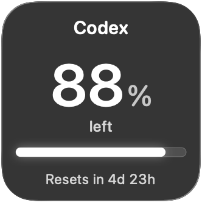
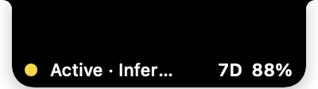
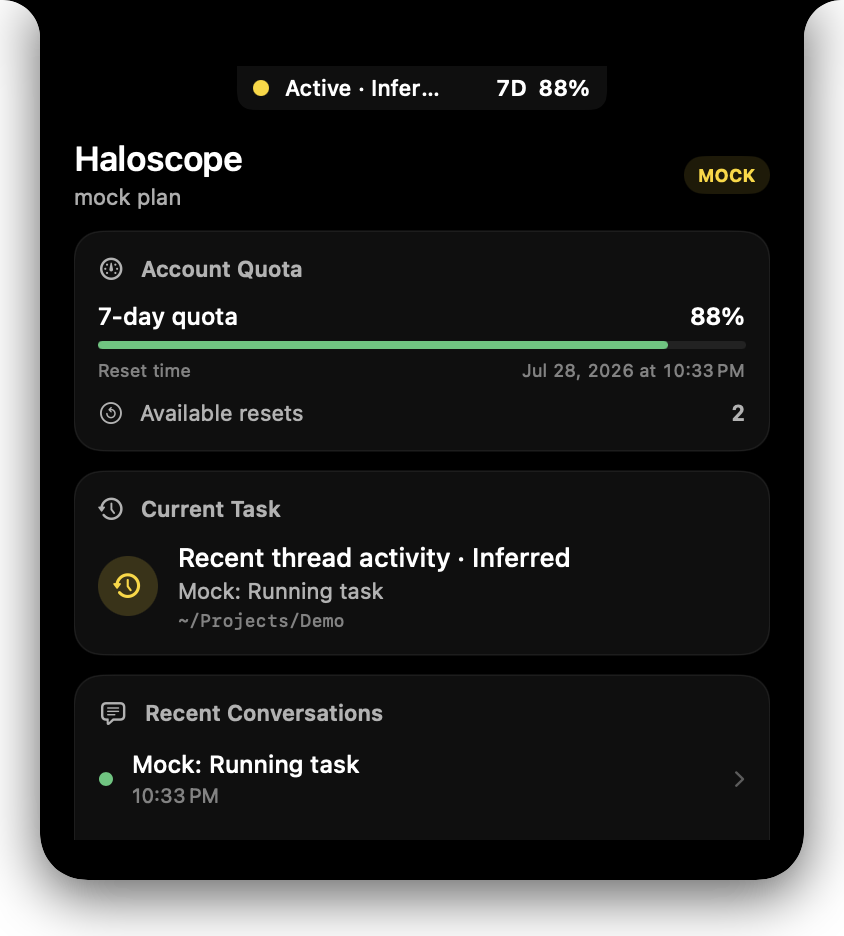
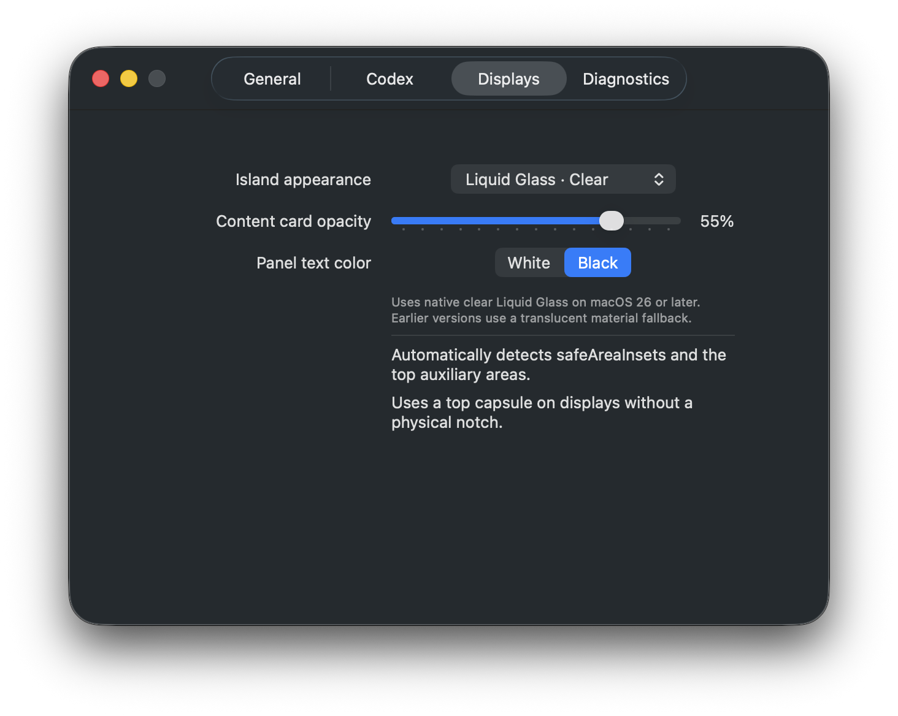

# Haloscope

English | [简体中文](README.zh-CN.md)

[](https://github.com/HaochengLuo/Haloscope/actions/workflows/ci.yml)

Haloscope is a native macOS Codex status monitor built with SwiftUI and an AppKit `NSPanel`. It combines a notch-attached status panel with a desktop widget and supports macOS 14 or later. All data comes from a separate `codex app-server --stdio` process: Haloscope does not read Codex Desktop's private database, scrape its UI, or estimate token counts.

> Haloscope is an unofficial open-source project and is not affiliated with or endorsed by OpenAI. Codex and related trademarks belong to their respective owners.

## Preview

<p align="center">
  
</p>

<p align="center"><em>Liquid Glass desktop widget</em></p>

<p align="center">
  
</p>

<p align="center"><em>Compact notch status</em></p>

<table>
  <tr>
    <td width="50%" valign="top"></td>
    <td width="50%" valign="top"></td>
  </tr>
  <tr>
    <td align="center"><em>Account and task overview</em></td>
    <td align="center"><em>Liquid Glass display settings</em></td>
  </tr>
</table>

## Current status

The interface can follow the system language or switch between English and Simplified Chinese at runtime. The desktop widget shows the remaining 7-day allowance, reset countdown, and available reset credits. Both the widget and notch panel use a Liquid Glass design, with the native glass effect on macOS 26 and a material fallback on earlier supported versions.

## Build and run

> The current public beta is source-only. It does not include a prebuilt `.app` or `.dmg`.

Requirements:

- macOS 14 or later to run Haloscope
- Xcode 26 or later, on a macOS version supported by that Xcode release, to build the current Liquid Glass source
- A working, authenticated Codex CLI installation; confirm that `codex --version` succeeds
- An Apple Account added to Xcode for signed local builds

A paid Apple Developer Program membership is not required to build and run Haloscope for personal use. Xcode's [free Personal Team](https://developer.apple.com/support/compare-memberships/) can be used locally, but those builds are not suitable for redistribution and may need periodic reprovisioning.

### Run from Xcode

1. Download the [source-only beta](https://github.com/HaochengLuo/Haloscope/releases/tag/v0.2.0-beta.2), or clone the repository:

   ```bash
   git clone https://github.com/HaochengLuo/Haloscope.git
   cd Haloscope
   open Haloscope.xcodeproj
   ```

2. In **Xcode → Settings → Accounts**, add your Apple Account.
3. For both the Haloscope and HaloscopeWidget targets, enable automatic signing and select the same Team. A free Personal Team is sufficient for local testing.
4. Give both targets identifiers owned by that Team. Use the same App Group and Keychain suffix in both targets:

   - App Bundle ID: `com.example.haloscope`
   - Widget Bundle ID: `com.example.haloscope.widget`
   - `HALOSCOPE_APP_GROUP_IDENTIFIER`: `TEAM_ID.com.example.haloscope`
   - `HALOSCOPE_KEYCHAIN_GROUP_SUFFIX`: `com.example.haloscope.shared`

   Set the Bundle IDs in **Signing & Capabilities**, and set the two `HALOSCOPE_...` values under **Build Settings** for both targets. Replace `TEAM_ID` and `com.example` with your own values. The App Group uses Apple's [macOS Team-ID-prefixed form](https://developer.apple.com/documentation/xcode/accessing-app-group-containers); the Keychain access-group prefix is added automatically.
5. Select the Haloscope scheme and **My Mac**, then run it.
6. Right-click the desktop, choose **Edit Widgets**, search for **Haloscope**, and add the small widget.

Haloscope looks for `codex` in this order: the custom path selected in Settings, `~/.local/bin`, Homebrew, system paths, and the login shell.

### Command-line checks and local packaging

Run the test suite from the command line:

```bash
swift test --disable-sandbox
```

To verify the complete app and widget-extension packaging without a signing identity:

```bash
UNSIGNED=1 scripts/build_app.sh
```

An unsigned widget cannot register with macOS. For a signed local build, provide your Team and unique identifiers through environment variables so personal signing information is not stored in the repository:

```bash
HALOSCOPE_DEVELOPMENT_TEAM=TEAM_ID \
HALOSCOPE_APP_BUNDLE_IDENTIFIER=com.example.haloscope \
HALOSCOPE_WIDGET_BUNDLE_IDENTIFIER=com.example.haloscope.widget \
HALOSCOPE_APP_GROUP_IDENTIFIER=TEAM_ID.com.example.haloscope \
HALOSCOPE_KEYCHAIN_GROUP_SUFFIX=com.example.haloscope.shared \
scripts/build_app.sh
```

The build output is written to `dist/Haloscope.zip`. A Personal Team ZIP is only for testing on your own Mac: it is not Developer ID signed or notarized and should not be redistributed. Other users should build the source with their own signing identifiers.

### Maintainer release rehearsal

To verify the public-release packaging without signing or notarization:

```bash
scripts/release_app.sh --unsigned --tag v0.2.0-beta.2
```

Unsigned artifacts are clearly labelled and are not suitable for distribution.
Developer ID release requirements and GitHub Actions configuration are documented
in the [distribution notes](docs/DISTRIBUTION.md).

Generated protocol schemas are intentionally excluded from Git history. Run `scripts/generate_protocol_schemas.sh` to recreate them locally when investigating protocol changes.

## Permissions and privacy

The current distribution design uses a non-sandboxed Developer ID app because Haloscope must launch the user-selected Codex CLI and let it access its normal state directory. Haloscope does not require Accessibility, screen recording, browser cookies, or ChatGPT credentials. See the [distribution notes](docs/DISTRIBUTION.md) for details.

## Known limitations

- Codex App Server does not expose the thread currently selected in Codex Desktop. Haloscope therefore labels thread selection as manual, automatically detected, inferred, or unavailable.
- Testing with Codex CLI 0.144.1 on July 14, 2026 returned only the 10,080-minute (7-day) primary allowance. Haloscope no longer displays the discontinued 5-hour allowance.
- `account/usage/read` returns calendar-day buckets rather than a rolling 24-hour window, so the UI describes the newest value as the latest available day.
- The captured probe did not include an active thread, so real-time token/context notifications and complete subagent behavior still need additional real-world validation. Haloscope does not display guessed values.
- The Developer ID release workflow is implemented, but publishing requires the maintainer's signing certificate and Apple notarization credentials.

## Troubleshooting

- **Codex not found:** select the executable in Settings and confirm that `codex --version` works in Terminal.
- **App Server failure:** inspect the redacted connection error. Do not include authentication responses in bug reports.
- **Swift/SDK mismatch:** install the full Xcode release, select it with `xcode-select`, and confirm that `xcrun swift --version` matches the active SDK.
- **Login item requires approval:** approve Haloscope under **System Settings → General → Login Items**.

Protocol evidence and implementation boundaries are documented in the [capability matrix](docs/CAPABILITY_MATRIX.md) and [protocol notes](docs/CODEX_PROTOCOL_NOTES.md).

## License

[MIT](LICENSE)
