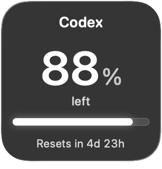
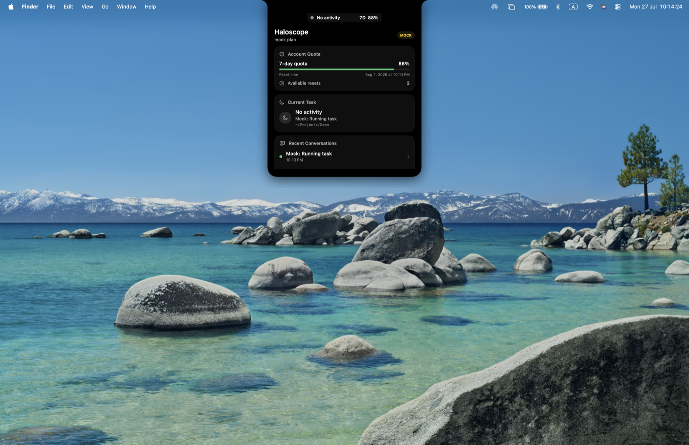
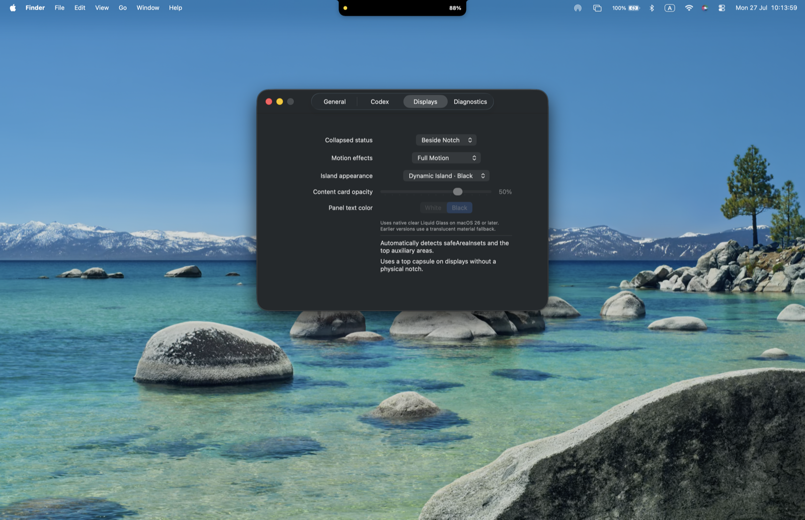

# Haloscope

English | [简体中文](README.zh-CN.md)

[](https://github.com/HaochengLuo/Haloscope/actions/workflows/ci.yml)

Haloscope keeps your Codex status visible at the top of your Mac. Its notch panel shows your remaining 7-day allowance, reset time, current activity, recent conversations, and token statistics, while the desktop widget keeps the most important quota information in view.

Haloscope supports macOS 14 or later and gets its data directly from the local `codex app-server`. It does not read Codex Desktop's private database, capture its interface, or guess usage numbers.

> Haloscope is an unofficial open-source project and is not affiliated with or endorsed by OpenAI. Codex and related trademarks belong to their respective owners.

## Preview

<p align="center">
  
</p>

<p align="center"><em>Liquid Glass desktop widget</em></p>

<p align="center">
  
</p>

<p align="center"><em>Account and task overview</em></p>

<p align="center">
  
</p>

<p align="center"><em>Notch and display settings</em></p>

## Features

- A compact notch status that expands into a full activity panel
- Three collapsed-status options: below the notch, beside the notch, or hidden
- Motion effects that can follow macOS, always reduce motion, or always use full motion
- Your remaining 7-day allowance, reset time, and available resets at a glance
- Current task, recent conversations, and token statistics
- A desktop widget with a Liquid Glass design for quota and reset information
- A notch panel that can switch between black and Liquid Glass appearances, including adjustable card opacity and panel text color
- English and Simplified Chinese, with in-app language switching

Liquid Glass uses the native effect on macOS 26 and a translucent material fallback on earlier supported versions.

## Install from source

> The signed beta remains source-only. The optional Unsigned Preview below is a separate
> downloadable channel and is not Developer ID signed or notarized.

### Before you start

You need:

- A Mac running macOS 14 or later
- Xcode 26 or later on a macOS version supported by Xcode
- An installed and signed-in Codex CLI
- An Apple Account added to Xcode

You do not need a paid Apple Developer Program membership for personal use. Xcode's [free Personal Team](https://developer.apple.com/support/compare-memberships/) is enough to run Haloscope on your own Mac, although you may occasionally need to rebuild it when the local signing expires.

### Installation

1. Download the [latest source beta](https://github.com/HaochengLuo/Haloscope/releases/tag/v0.2.0-beta.2), or clone the repository:

   ```bash
   git clone https://github.com/HaochengLuo/Haloscope.git
   cd Haloscope
   open Haloscope.xcodeproj
   ```

2. Confirm that Codex is ready:

   ```bash
   codex --version
   ```

3. In **Xcode → Settings → Accounts**, add your Apple Account if it is not already listed.
4. Select the Haloscope project, then open **Signing & Capabilities** for both the **Haloscope** and **HaloscopeWidget** targets. Enable automatic signing and choose the same Team for both.
5. Replace the example identifiers with values unique to you:

   - App Bundle ID: `com.example.haloscope`
   - Widget Bundle ID: `com.example.haloscope.widget`
   - App Group: `TEAM_ID.com.example.haloscope`
   - Keychain suffix: `com.example.haloscope.shared`

   Set the Bundle IDs in **Signing & Capabilities**. In **Build Settings**, set `HALOSCOPE_APP_GROUP_IDENTIFIER` and `HALOSCOPE_KEYCHAIN_GROUP_SUFFIX` to the same values for both targets. Replace `TEAM_ID` and `com.example` with your own Team ID and identifier. Haloscope uses Apple's [Team-ID-prefixed App Group format](https://developer.apple.com/documentation/xcode/accessing-app-group-containers) for macOS.
6. Select the **Haloscope** scheme and **My Mac**, then click Run.
7. To add the widget, right-click the desktop, choose **Edit Widgets**, search for **Haloscope**, and add the small widget.

Haloscope normally finds Codex automatically in common installation locations. If it does not, open Haloscope Settings and choose the `codex` executable manually.

## Optional Unsigned Preview

If you do not want to build with Xcode, you may use the
[Unsigned Preview installation](docs/UNSIGNED_PREVIEW.md). It keeps the notch
panel and Codex connection, but excludes the desktop Widget, automatic updates, and
launch at login. It is manually updated, requires the documented macOS approval
flow, and every download must be checksum-verified. The Personal Team source
build above remains the recommended no-cost installation method.

### Download the Preview DMG

Open the [GitHub Releases page](https://github.com/HaochengLuo/Haloscope/releases)
and choose the newest **Haloscope Unsigned Preview** pre-release. Download the
matching `-macos-universal-unsigned.dmg` and `-SHA256SUMS.txt` assets, then verify
the checksum before opening the DMG:

```bash
shasum -a 256 -c Haloscope-<version>-SHA256SUMS.txt
```

After the result reports `OK`, open the DMG, drag `Haloscope Preview.app` to
`Applications`, and follow the macOS Finder or Privacy & Security approval
flow. The release also provides a ZIP and dSYM archive for testers and
diagnostics; none of these assets are automatically updated.

## Privacy

Haloscope communicates with a local `codex app-server` process to show your activity and usage. It does not read Codex Desktop's private database, capture the screen, collect browser cookies, or ask for ChatGPT credentials.

Haloscope does not require Accessibility or screen-recording permission. Because it needs to launch your local Codex CLI, the current app design runs outside the App Sandbox.

## Current limitations

- Codex App Server does not reveal which thread is currently selected in Codex Desktop, so Haloscope may label the selection as manual, detected, inferred, or unavailable.
- Only support checking 7d quota
- Daily token values follow calendar-day buckets rather than a rolling 24-hour window.
- Live token, context, and subagent details appear only when Codex App Server provides them. Haloscope does not fill missing data with estimates.
- The beta is currently distributed as source code only. A notarized downloadable app is not available yet.

## Troubleshooting

- **Haloscope cannot find Codex:** open Settings and choose the `codex` executable, then confirm that `codex --version` works in Terminal.
- **The widget does not appear or update:** make sure the app and widget use the same Team, App Group, and Keychain suffix. Unsigned builds cannot register the widget.
- **The Codex connection fails:** check the connection message in Settings and verify that Codex CLI is signed in.
- **A Personal Team build stops opening:** rebuild and run it from Xcode to refresh the local signing.
- **Login at startup needs approval:** enable Haloscope under **System Settings → General → Login Items**.
- **Xcode reports a Swift or SDK mismatch:** install the full Xcode release, select it with `xcode-select`, and confirm that `xcrun swift --version` matches the active SDK.

Contributor-oriented protocol details are available in the [capability matrix](docs/CAPABILITY_MATRIX.md) and [protocol notes](docs/CODEX_PROTOCOL_NOTES.md).

## License

[MIT](LICENSE)
