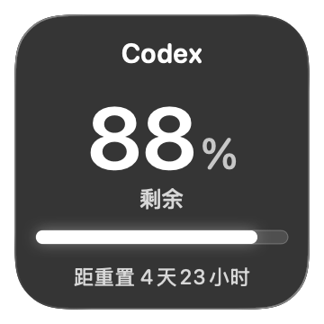
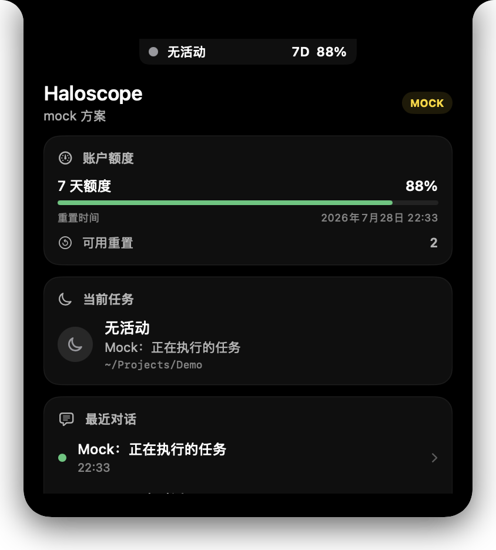
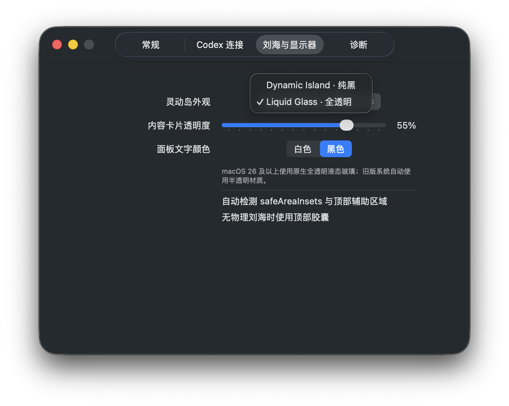

# Haloscope

[English](README.md) | 简体中文

[](https://github.com/HaochengLuo/Haloscope/actions/workflows/ci.yml)

原生 SwiftUI + AppKit `NSPanel` 的 Codex 状态监控器，包含刘海状态面板与 macOS 桌面小组件，部署目标 macOS 14。数据来自独立的 `codex app-server --stdio`，不读取 Codex Desktop 私有数据库，不抓取 UI，不估算 token。

> Haloscope 是非官方开源项目，与 OpenAI 不存在隶属或背书关系。Codex 名称及相关商标归其权利人所有。

## 界面预览

<p align="center">
  
</p>

<p align="center"><em>Liquid Glass 桌面小组件</em></p>

<p align="center">
  
</p>

<p align="center"><em>紧凑刘海状态</em></p>

<table>
  <tr>
    <td width="50%" valign="top"></td>
    <td width="50%" valign="top"></td>
  </tr>
  <tr>
    <td align="center"><em>账户与任务概览</em></td>
    <td align="center"><em>Liquid Glass 显示设置</em></td>
  </tr>
</table>

## 当前状态

界面支持跟随系统语言，或在英文与简体中文之间实时切换。桌面小组件显示当前 7D 剩余额度、重置倒计时与可用重置次数；桌面小组件和刘海面板均采用 Liquid Glass 设计。

## 运行

1. 在 Xcode 中打开 `Haloscope.xcodeproj`，为 Haloscope 与 HaloscopeWidget 两个 target 选择同一个 Team，并将 Bundle ID、App Group 和 Keychain Group 改为属于该 Team 的唯一标识，然后运行 Haloscope scheme。
2. 运行后，在桌面右键“编辑小组件”，搜索 “Haloscope”，添加小号组件。
3. 应用按自定义路径、`~/.local/bin`、Homebrew、系统路径、login shell 的顺序寻找 `codex`。

命令行验证可运行 `swift test --disable-sandbox`。尚未配置签名身份时，可用 `UNSIGNED=1 scripts/build_app.sh` 验证完整 app/appex 包装，但未签名的小组件不能注册到系统。

签名构建通过环境变量提供本地 Team，不在仓库中保存个人签名信息：

```bash
HALOSCOPE_DEVELOPMENT_TEAM=YOUR_TEAM_ID scripts/build_app.sh
```

如使用自己的 App Group，同时传入 `HALOSCOPE_APP_GROUP_IDENTIFIER` 和 `HALOSCOPE_KEYCHAIN_GROUP_SUFFIX`。构建输出为 `dist/Haloscope.zip`。

可以先验证公开发行包的构建和 DMG 布局：

```bash
scripts/release_app.sh --unsigned --tag v0.2.0-beta.1
```

无签名产物会明确带有 `-unsigned` 后缀，不能用于公开分发。Developer ID
发行条件和 GitHub Actions 配置详见[分发说明](docs/DISTRIBUTION.md)。

协议 Schema 不纳入 Git 历史，需要排查协议变化时运行 `scripts/generate_protocol_schemas.sh` 在本地重新生成。

## 权限与隐私

MVP 建议非 Sandbox 的 Developer ID 分发，因为需要启动用户的 Codex CLI 并访问其正常状态目录。应用不需要 Accessibility、屏幕录制、浏览器 Cookie 或 ChatGPT 凭证权限。详见 [分发说明](docs/DISTRIBUTION.md)。

## 已知限制

- App Server 没有暴露 Codex Desktop 当前选中线程；界面必须显示手动绑定、自动识别、推断或不可用。
- 2026-07-14 的 Codex CLI 0.144.1 实测仅返回 10080 分钟（7D）主额度；界面不再显示已取消的 5H 额度。
- `account/usage/read` 是自然日 bucket，“24 小时”只能表述为最近可用日。
- 本次探针没有活动线程，未取得实时 token/context notification 实例；不显示推测数字。
- 当前实现已可编译并通过测试；Developer ID 发行流程已经实现，但真正发布仍需要维护者的签名证书和 Apple 公证凭据。

## 故障排除

- “未找到 codex”：在设置中选择可执行文件，并确认 `codex --version` 可运行。
- App Server 失败：查看脱敏连接错误；不要复制认证响应。
- Swift/SDK mismatch：安装完整 Xcode并切换 `xcode-select`，确保 `xcrun swift --version` 与 SDK build 匹配。
- 登录项 requiresApproval：在“系统设置 → 通用 → 登录项”批准。

协议证据见 [能力矩阵](docs/CAPABILITY_MATRIX.md) 与 [协议记录](docs/CODEX_PROTOCOL_NOTES.md)。

## License

[MIT](LICENSE)
