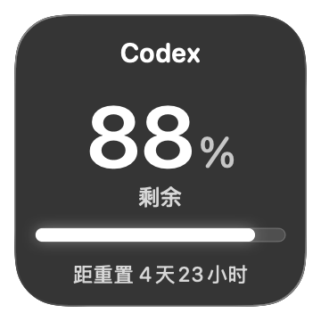
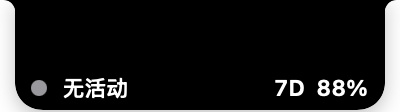
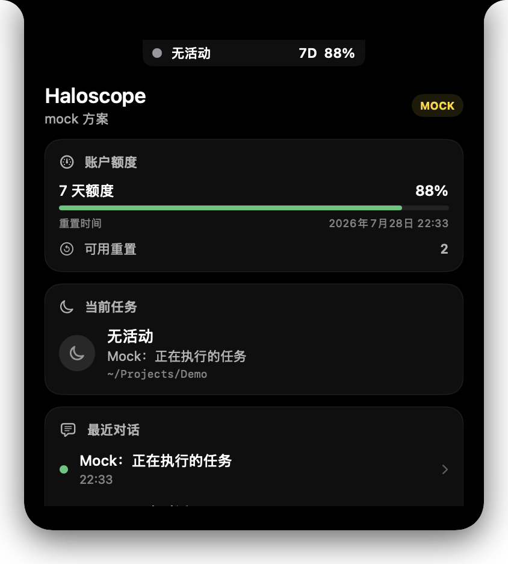
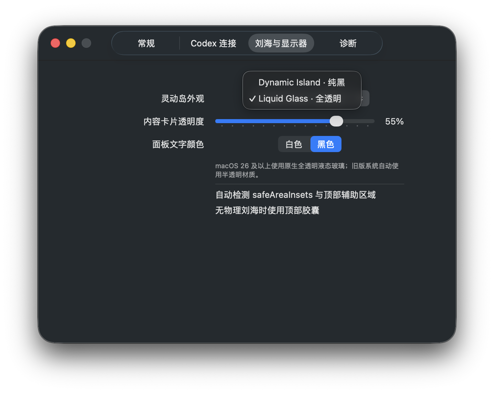

# Haloscope

[English](README.md) | 简体中文

[](https://github.com/HaochengLuo/Haloscope/actions/workflows/ci.yml)

Haloscope 将 Codex 状态放在 Mac 屏幕顶部，方便随时查看。刘海面板可以显示 7 天剩余额度、重置时间、当前活动、最近对话和 Token 统计；桌面小组件则持续显示最重要的额度信息。

Haloscope 支持 macOS 14 或更高版本，数据直接来自本机的 `codex app-server`。它不会读取 Codex Desktop 私有数据库、截取界面或猜测使用量。

> Haloscope 是非官方开源项目，与 OpenAI 不存在隶属或背书关系。Codex 名称及相关商标归其权利人所有。

## 界面预览

<p align="center">
  
</p>

<p align="center"><em>Liquid Glass 桌面小组件</em></p>

<p align="center">
  
</p>

<p align="center"><em>紧凑刘海状态</em></p>

<table>
  <tr>
    <td width="50%" valign="top"></td>
    <td width="50%" valign="top"></td>
  </tr>
  <tr>
    <td align="center"><em>账户与任务概览</em></td>
    <td align="center"><em>Liquid Glass 显示设置</em></td>
  </tr>
</table>

## 主要功能

- 刘海区域显示简洁状态，移入后展开完整活动面板
- 随时查看 7 天剩余额度、重置时间和可用重置次数
- 查看当前任务、最近对话和 Token 统计
- 使用桌面小组件持续显示额度和重置信息
- 支持 Dynamic Island 与 Liquid Glass 外观，并可调整卡片透明度和文字颜色
- 支持英文和简体中文，可在应用内随时切换

在 macOS 26 上会使用原生 Liquid Glass；较早的受支持系统会自动使用半透明材质。

## 从源码安装

> 当前 Beta 仅提供源代码，暂时没有可直接下载的 `.app` 或 `.dmg`。

### 开始之前

你需要准备：

- 一台运行 macOS 14 或更高版本的 Mac
- Xcode 26 或更高版本，以及该 Xcode 版本所支持的 macOS
- 已安装并登录的 Codex CLI
- 已添加到 Xcode 的 Apple Account

个人使用不需要付费加入 Apple Developer Program。Xcode 的[免费 Personal Team](https://developer.apple.com/support/compare-memberships/)即可在自己的 Mac 上运行 Haloscope；本地签名到期后，可能需要重新编译一次。

### 安装步骤

1. 下载[最新源码 Beta](https://github.com/HaochengLuo/Haloscope/releases/tag/v0.2.0-beta.2)，或克隆仓库：

   ```bash
   git clone https://github.com/HaochengLuo/Haloscope.git
   cd Haloscope
   open Haloscope.xcodeproj
   ```

2. 确认 Codex 已准备好：

   ```bash
   codex --version
   ```

3. 如果 Xcode 中还没有你的账号，请在 **Xcode → Settings → Accounts** 添加 Apple Account。
4. 选择 Haloscope 工程，分别打开 **Haloscope** 和 **HaloscopeWidget** target 的 **Signing & Capabilities**，启用自动签名，并为两者选择同一个 Team。
5. 将示例标识符替换为属于你自己的唯一值：

   - 主应用 Bundle ID：`com.example.haloscope`
   - Widget Bundle ID：`com.example.haloscope.widget`
   - App Group：`TEAM_ID.com.example.haloscope`
   - Keychain 后缀：`com.example.haloscope.shared`

   Bundle ID 在 **Signing & Capabilities** 中设置。在两个 target 的 **Build Settings** 中，将 `HALOSCOPE_APP_GROUP_IDENTIFIER` 和 `HALOSCOPE_KEYCHAIN_GROUP_SUFFIX` 设为相同的值。请用自己的 Team ID 和标识符替换 `TEAM_ID` 与 `com.example`。Haloscope 使用 Apple 的 [macOS Team ID 前缀 App Group 格式](https://developer.apple.com/documentation/xcode/accessing-app-group-containers)。
6. 选择 **Haloscope** scheme 和 **My Mac**，然后点击运行。
7. 如需添加小组件，请在桌面右键选择“编辑小组件”，搜索“Haloscope”，添加小号组件。

Haloscope 通常可以从常见安装位置自动找到 Codex。如果没有检测到，请打开 Haloscope 设置并手动选择 `codex` 可执行文件。

## 隐私

Haloscope 通过本机的 `codex app-server` 显示活动和使用情况。它不会读取 Codex Desktop 私有数据库、截取屏幕、收集浏览器 Cookie，也不会要求提供 ChatGPT 凭证。

Haloscope 不需要辅助功能或屏幕录制权限。由于需要启动本机 Codex CLI，当前应用设计不使用 App Sandbox。

## 当前限制

- Codex App Server 不会告知 Haloscope 当前在 Codex Desktop 中选中了哪个线程，因此界面可能将线程标记为手动、已检测、推断或不可用。
- Haloscope 目前显示 Codex App Server 提供的 7 天额度，不显示已经取消的 5 小时额度。
- 每日 Token 数据按自然日统计，不是滚动 24 小时数据。
- 实时 Token、上下文和子代理详情只有在 Codex App Server 提供时才会显示；Haloscope 不会用估算值补全缺失数据。
- 当前 Beta 仅通过源代码发布，暂时没有经过公证、可直接下载的应用。

## 故障排除

- **Haloscope 找不到 Codex：**打开设置并选择 `codex` 可执行文件，同时确认终端中可以运行 `codex --version`。
- **小组件没有出现或不更新：**确认主应用和小组件使用相同的 Team、App Group 与 Keychain 后缀；未签名构建无法注册小组件。
- **Codex 连接失败：**查看设置中的连接提示，并确认 Codex CLI 已经登录。
- **Personal Team 构建无法继续打开：**在 Xcode 中重新编译并运行，以刷新本地签名。
- **开机启动需要批准：**前往“系统设置 → 通用 → 登录项”启用 Haloscope。
- **Xcode 提示 Swift 或 SDK 不匹配：**安装完整 Xcode，使用 `xcode-select` 选择它，并确认 `xcrun swift --version` 与当前 SDK 一致。

面向贡献者的协议细节请参阅[能力矩阵](docs/CAPABILITY_MATRIX.md)与[协议记录](docs/CODEX_PROTOCOL_NOTES.md)。

## License

[MIT](LICENSE)
